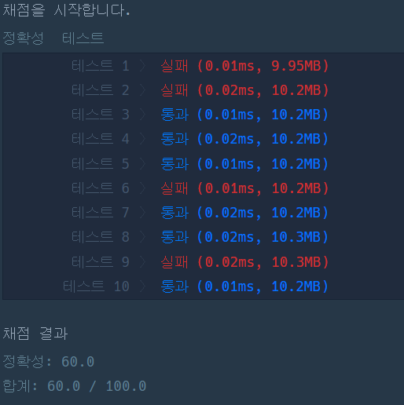

# 프로그래머스0Lv 겹치는 선분의 길이

### 내가 쓴 코드
```python
def solution(lines):
    answer = 0
    l  = [0 for i in range(-100, 101)]
    answers = []
    
    for i in range(len(lines)):
        j = 1
        start = 0
        end = 0
        while i+j <= len(lines)-1:
            target1 = lines[i]
            target2 = lines[i+j]
            
            if start:
                start = min(start, max(target1[0], target2[0]))
                end = max(end, min(target1[1], target2[1]))
            else:
                start = max(target1[0], target2[0])
                end = min(target1[1], target2[1])
            
            j += 1
        if start<end:
                answer += end-start
        
    return answer
```
- 채점 결과



- 문제점
1. test3과 같이 여러 개가 같이 겹칠 때, start, end 변수로 판별하는 코드를 짜지 못했음.
2. start와 end가 2번째 선분과 3번째 선분을 비교할 때 0,0으로 초기화가 되어서  min 계산이 잘 되지 않음