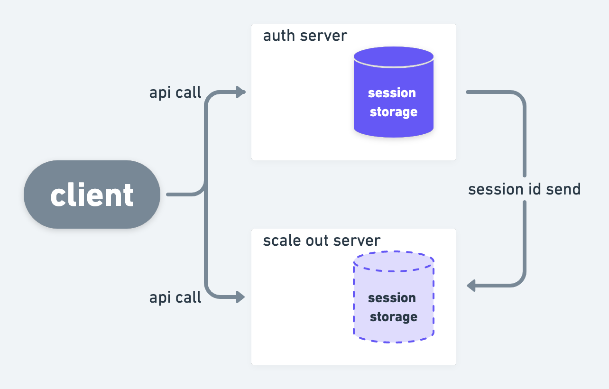
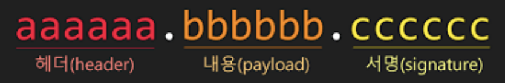

# JWT(Json Web Token) 인증방식

## Cookie
> 클라이언트가 웹 사이트에 접속하면 남는 작은 기록 파일   
> 접속자 장치를 인식하거나 일부 데이터를 저장하는 역할   
> 서버가 클라이언트에 정보를 전달할 떄, 전달하고자 하는 정보를 응답 헤더(Cookie)에 저장하여 전달한다.   
> Key Value 형식의 문자열 형태로 저장한다.   
    
 최초로 ID, pw로 로그인을 하면, 이후에는 로그인이 된 상태에서 요청을 날릴 수가 있다. 만약 ,쿠키가 없었다면 매번 요청을 할 때마다 쿠키로 ID, PW를 동시에 날려야하는 번거로움이 생겼었던 것이다.

>POST http://localhost:8080/api/login   
> HTTP/1.1 200 
Set-Cookie: id=jinyoungchoi95; Max-Age=10000; Expires=Mon, 15-Nov-2021 16:29:57 GMT   
> Set-Cookie: pw=jycpassword12; Max-Age=10000; Expires=Mon, 15-Nov-2021 16:29:57 GMT   

### Cookie의 단점
> 1. id, pw에 대한 민감 정보까지 다 노출이 되어 보안이 좋지 않다.
> 2. 웹 브라우저마다 쿠키에 대한 지원 형태가 다르기 때문에, 브라우저 간의 공유가 불가능
> 3. 쿠키의 사이즈 제한 때문에, 원하는 만큼의 충분한 데이터를 담을 수 없다.
> 4. 서버는 매번 id, pw를 받아서 인증을 해야하는 번거로움
> 5. 조작된 데이터가 넘어오는 경우, 방지할 수 없다.   
   

이를 보완하기 위해 나온 것이 Session이다.
***

## Cookie & Session
여기서 id pw를 주고 받지 말고 인증 정보자체를 특정 세션 저장소에 저장하고, 이 값을 쿠키에 담아 클라이언트가 쿠키를 요청할 때마다 세션 저장소에 있는 정보랑 동일한지로 로그인을 확인하자가 주요 핵심이다.

> 1. 클라이언트가 id pw로 서버에 로그인 요청을 한다.
> 2. id pw로 인증 후 사용자를 식별할 특정 유니크한 세션 ID를 만들어 마치 자물쇠처럼 서버의 세션 저장소에 저장한다.
> 3. 세션 ID를 특정한 형태(쿠키 or json)로 클라이언트에 다시 반환한다.
> 4. 이후 사용자 인증이 필요한 정보를 요청할 때마다 이 세션 ID를 쿠키에 담아 서버에 함께 전달한다.
> 5. 인증이 필요한 api일 때, 서버는 세션 ID가 세션 저장소에 있는 지 확인한다.
>6. 있다면 인증 완료 후 api 처리, 없다면 401 에러를 반환한다.

### Session을 사용했을 때의 단점
> * 세션 저장소의 문제가 발생하면 인증 체계가 무너져 이전에 다른 인증된 유저 또한 인증이 불가해진다.
> * stateful하기 때문에 http의 장점을 발휘하지 못하고 scale out에 걸림돌이 생긴다. -> 이는 http에서 다루는 내용
> *세션 저장소가 필수적으로 존재하기 때문에 이를 사용하기위한 비용이 든다.
> * 세션 ID가 탈취되었을 경우 대처는 가능하지만 클라이언트인척 위장하는 보안의 약점이 있을 수 있다.
> * 사용자가 많아질수록 메모리를 많이 차지하게 된다.
> * "매번" 요청 시 DB에서 세션 저장소를 조회해야하는 단점이 있다.

***
## JWT의 등장
> 인증에 필요한 정보들을 Token에 담아 암호화시켜 사용하는 토큰이다.   
> 기본적인 인증을 진행하는 구조는 Cookie때와 크게 다르지는 않지만, 강조되는 점은 JWT는 서명된 토큰이라는 점이다.  공개/개인 키를 쌍으로 사용하여 토큰에 서명할 경우 서명된 토큰은 개인 키를 보유한 서버가 이 서명된 토큰이 정상적인 토큰인지 인증할 수 있다는 이야기이죠.

 

### JWT의 구조

> 1. header
> 2. payload
> 3. Signature

